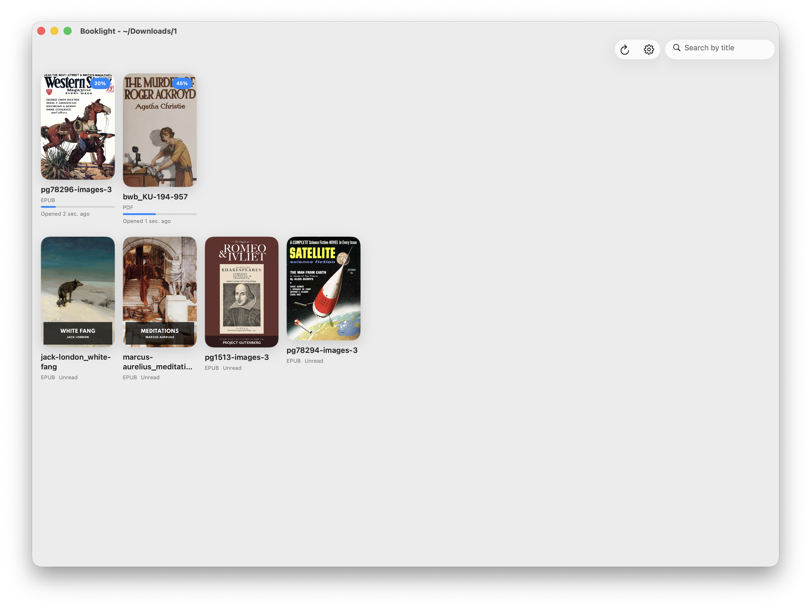

# Booklight

A light and fast book reader for iPad and Mac.

Booklight is a focused reading app that stays out of your way. It opens PDFs and EPUBs from your own folders, remembers where you left off, and seamlessly syncs your reading position across devices — no accounts, no cloud, no fuss.

## Screenshots

<!-- Replace these placeholders with actual screenshots -->




## Features

- **PDF and EPUB support** — read both formats with a clean, distraction-free interface
- **Position tracking** — automatically saves your reading position in every book
- **Cross-device sync** — share your reading progress between devices using Syncthing or any file-sync tool
- **Privacy-first** — no analytics, no cloud accounts, no network calls; works 100% offline
- **Fast library scanning** — artwork and file hashes are aggressively cached for instant startup
- **Fuzzy search** — quickly find books by partial or approximate title matches

## How It Works

Booklight separates your full book collection from the small set of books you're actively reading.

### Local Libraries

Point the app at one or more folders containing your books. These are read-only scan sources — the app discovers books but never modifies your files. Your full collection can live on a large drive or NAS.

### Active Books

When you open a book, it becomes part of your **Active Books** set. Reading progress is stored in a small arbitrary tracking directory. Active books are ordered by most recently read, so you always see what you're currently working through.

### Sharing and Sync

The tracking directory can be shared **independently** from your full library. This is the key design: you can sync just your active books and their progress to a mobile device where storage is limited, while keeping the full collection on your desktop.

Use [Syncthing](https://syncthing.net/) or any file-sync tool to share the tracking directory. When the same book is read on multiple devices, progress merges automatically — the furthest reading position wins.

## Installation

### macOS (Homebrew)

```bash
brew install anatol/tap/booklight
```

### Build from Source

See the [Development Guide](doc/DEVELOPMENT.md) for build instructions.

## Platforms

- **iPad** — iPadOS 26+
- **Mac** — macOS 26+ (via Mac Catalyst)

## Privacy

Booklight makes zero network calls. There are no analytics, no telemetry, no cloud accounts. All data stays on your device and in your folders.

## Links

- [Development Guide](doc/DEVELOPMENT.md)
- [Homebrew Tap](https://github.com/anatol/homebrew-tap)
